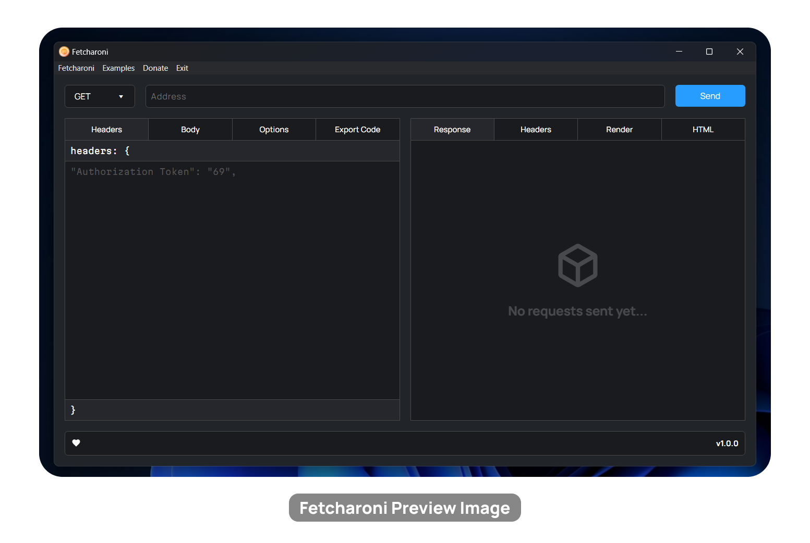

axoget

Simple and fast API testing

---

# ❓ About

axoget is a simple app that allows you to test out an API or make http requests. It uses the Node.js fetch API. axoget is a simple and lightweight version of something like Insomnia or Postman. It is not entirely an alternative as it does not have a lot of the features that other similar apps like Insomnia or Postman offer.

Remember, you are writing JavaScript so in the address input if you put `${1 + 1}` it will be 2.

I made this project to learn more about Electron and TypeScript. You can [donate](https://www.patreon.com/axorax) if you like the project or want to support me! <3

To download, go to the releases page. The file `axoget.exe` is the sinlge executable file. You can also find setup files in various formats.

# 📜 Scripts

| Command      | Usage                  | Description                                                         |
| ------------ | ---------------------- | ------------------------------------------------------------------- |
| build        | `npm run build`        | Build the project                                                   |
| dev          | `npm run dev`          | Open the app in dev mode (all code changes take effect immediately) |
| lint:styles  | `npm run lint:styles`  | Run stylelint for scss                                              |
| start        | `npm start`            | Start the app                                                       |
| nstart       | `npm run nstart`       | Open the app with nodemon (scss file changes don't take effect)     |
| ts           | `npm run ts`           | Watch for changes to typescript files                               |
| pug          | `npm run pug`          | Watch pug file for changes                                          |
| electron     | `npm run electron`     | It fixes the script.js file and runs electron                       |
| watch-scss   | `npm run watch-scss`   | Watch style.scss file for changes                                   |
| compile-scss | `npm run compile-scss` | Compile style.scss file                                             |

> [!NOTE]  
> When running the app for the first time (with the source code not the executable), it may restart a few times as it needs to compile TypeScript, SCSS and Pug. Also you may get an error popup at the start, ignore it and wait. None of this happens in the production executable app.

# 🙋‍♂️ FAQ

## Difference between preview and render?

Preview loads the HTML directly. Render loads the HTMl with absolute paths for script and style tags. So, if some HTML does not work in preview (CSS doesn't appear) then it might work in render.

# 🤝 Contributing

Feel free to contribute. PRs on making the output file size smaller would be very much appreciated. Do not make a PR if it matches any one of the conditions below:

- Only refactoring code
- Just a variable, class, id, etc. name change
- Breaks other functionality
- Does nothing meaningful (is useless)
- Contains NSFW content

---

<a href="https://www.patreon.com/axorax">Support me on Patreon</a> — <a href="https://github.com/axorax/socials">Check out my socials</a>

