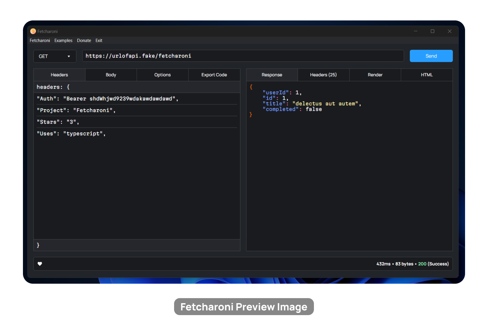

Fetcharoni

Simple and fast API testing

---

# ❓ About

Fetcharoni is a simple app that allows you to test out an API or make http requests. It uses the Node.js fetch API. Fetcharoni is a simple and lightweight version of something like Insomnia or Postman. It is not entirely an alternative as it does not have a lot of the features that other similar apps like Insomnia or Postman offer. I made this project to learn more about Electron. You can [donate](https://www.patreon.com/axorax) if you like the project or want to support me! <3

To download, go to the releases page. The file `fetcharoni.exe` is the sinlge executable file. You can also find setup files in various formats.

# 🤝 Contributing

Feel free to contribute. PRs on making the output file size smaller would be very much appreciated. Do not make a PR if it matches any one of the conditions below:

- Only refactoring code
- Just a variable, class, id, etc. name change
- Breaks other functionality
- Does nothing meaningful (is useless)
- Contains NSFW content

---

<a href="https://www.patreon.com/axorax">Support me on Patreon</a> — <a href="https://github.com/axorax/socials">Check out my socials</a>

